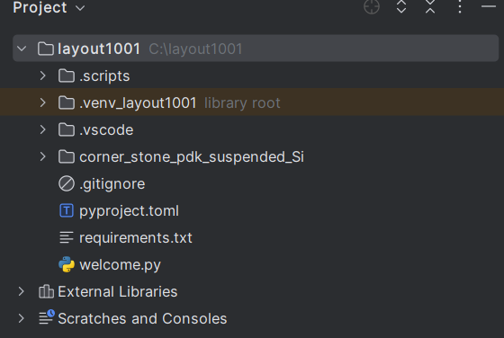

Install PhotoCAD and CORNERSTONE Suspended Si PDK
===================================================

Once Python and Pycharm are installed, you can follow the instructions to install **PhotoCAD** via **PIC Studio**. After installation, we will find the completed **fnpcell** and **gpdk** packages in ``Lib>site-packages``. **fnpcell** is the main package of **PhotoCAD**, which is used for parametric layout component scripts and layout routing scripts. **gpdk** is a collection of all examples in **PhotoCAD**. It contains both component cell layout scripts and other design templates based on parametric component cells.

To install corner_stone_pdk_suspended_Si package to **PhotoCAD**, extract ``corner_stone_pdk_suspended_Si.zip`` to the project folder (normally it should be named ``layout1001``).

